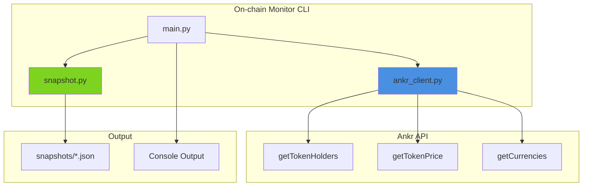

# RATU On-chain Monitor

[Python 3.10+](https://www.python.org/downloads/) | [uv](https://github.com/astral-sh/uv) | [RATUProject](https://github.com/adityonugrohoid)

On-chain token holder analytics and whale tracking using the Ankr API.


## Production Readiness

**Level: POC**

This system demonstrates prototyping-focused on-chain analytics with:
- **Three-mode architecture** (Basic Info, Top Holders, Full Snapshot)
- **Pagination handling** for tokens with millions of holders
- **Known label identification** for exchanges and special addresses
- **Snapshot comparison** for tracking holder changes over time

> **System Prototyping Focus**: Real-time holder monitoring with paginated API queries and snapshot comparison

## Part of RATUProject

This repository is part of **RATUProject** (Real-time Automated Trading Unified) - an open-source portfolio demonstrating real-time, event-driven system design for financial markets and blockchain integrations.

## Features

| Feature | Description |
|---------|-------------|
| **Basic Info** | Get token name, symbol, price, and top holders (fast) |
| **Top Holders** | View largest token holders with known labels |
| **Holder Snapshots** | Create timestamped snapshots of all holders |
| **Multi-Chain** | BSC, Ethereum, Polygon, Arbitrum, Base, Avalanche |

## Usage

```bash
# Sync dependencies
uv sync

# Configure API key
cp .env.example .env
# Edit .env and add your ANKR_API_KEY

# Get basic token info (fast, ~5 seconds)
uv run onchain-monitor basic <contract> [chain]

# View top 20 holders with labels (fast, ~3 seconds)
uv run onchain-monitor holders <contract> [chain]

# Create full holder snapshot (SLOW - paginates all holders, may take 2-5 minutes)
# Saves to: snapshots/holders_<chain>_<timestamp>.json
uv run onchain-monitor snapshot <contract> [chain]

# Help
uv run onchain-monitor help
```

### Examples

```bash
# Basic info for ASTER token on BSC
uv run onchain-monitor basic 0x000Ae314E2A2172a039B26378814C252734f556A bsc

# Top holders for ASTER on BSC
uv run onchain-monitor holders 0x000Ae314E2A2172a039B26378814C252734f556A bsc

# Full snapshot for ASTER on BSC (warning: slow for large holder counts)
uv run onchain-monitor snapshot 0x000Ae314E2A2172a039B26378814C252734f556A bsc
```

### Sample Output - Basic Info

```
================================================================================
  ON-CHAIN MONITOR - Token Info (bsc)
================================================================================
  Contract: 0x000Ae314E2A2172a039B26378814C252734f556A

  Name: Aster
  Symbol: ASTER
  Decimals: 18
  Price: $0.954785

  Top 5 Holders:
    1. 0xE8c3e6559513eEbA... 3,333,860,328
    2. 0xdfA61Ef61A1AF730... 1,411,200,000
    3. 0x128463A60784c4D3... 632,791,213
```

### Sample Output - Top Holders

```
================================================================================
  ON-CHAIN MONITOR - Top Holders (bsc) | Aster (ASTER)
================================================================================
  #    Address                                      Balance            Label
  --------------------------------------------------------------------------------------
  6    0x5a52E96BAcdaBb82fd05763E25335261B270Efcb     385,968,863.00  OKX
  9    0xF977814e90dA44bFA03b6295A0616a897441aceC     100,000,000.00  Binance Hot Wallet
  10   0x000000000000000000000000000000000000dEaD      77,860,491.03  Burn Address
```

### Sample Output - Snapshot JSON

Snapshots are saved to `snapshots/holders_<chain>_<timestamp>.json`:

```json
{
  "timestamp": "2025-12-12T16:20:00.631834",
  "contract": "0x000Ae314E2A2172a039B26378814C252734f556A",
  "blockchain": "bsc",
  "token_name": "Aster",
  "token_symbol": "ASTER",
  "holder_count": 197048,
  "price_usd": 0.9562610795106671,
  "holders": [
    {
      "address": "0xE8c3e6559513eEbAc3e05fd75c19a17F4A51A892",
      "balance": "3333860328",
      "balance_raw": "3333860328000000000000000000",
      "label": ""
    },
    {
      "address": "0xF977814e90dA44bFA03b6295A0616a897441aceC",
      "balance": "100000000",
      "balance_raw": "100000000000000000000000000",
      "label": "Binance Hot Wallet"
    }
  ]
}
```

## System Overview



## Project Structure

```
ratu-onchain-monitor/
  src/onchain_monitor/
    __init__.py
    config.py         # API and chain settings
    ankr_client.py    # Ankr API client with holder labels
    snapshot.py       # Holder snapshot utilities
    main.py           # CLI entry point
  tests/
  snapshots/          # Output directory for snapshot JSON files
```

## Design Decisions

| Decision | Rationale |
|----------|-----------|
| httpx | Connection pooling for repeated API calls |
| Pagination | Handle tokens with millions of holders |
| Known labels | Identify exchanges/burn addresses automatically |
| Snapshot comparison | Track holder changes over time |

## Known Holder Labels

The tool automatically identifies known wallets:
- **Exchanges**: Binance, OKX, Bybit
- **Special**: Burn Address, Null Address

## Notable Code

This repository demonstrates prototyping-focused on-chain analytics patterns. See [NOTABLE_CODE.md](NOTABLE_CODE.md) for detailed code examples highlighting:

- Three-mode architecture implementation
- Pagination handling for large datasets
- Known label identification system

## License

This project is licensed under the MIT License - see the [LICENSE](LICENSE) file for details.

## Author

**Adityo Nugroho**  
- Portfolio: https://adityonugrohoid.github.io  
- GitHub: https://github.com/adityonugrohoid  
- LinkedIn: https://www.linkedin.com/in/adityonugrohoid/
