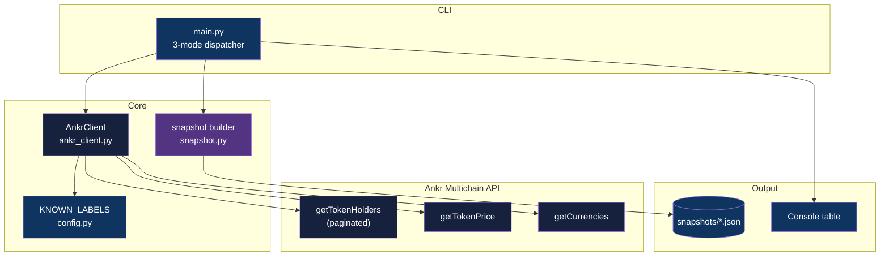

<div align="center">

# RATU On-chain Monitor

[](https://www.python.org/downloads/)
[](https://github.com/astral-sh/uv)
[](LICENSE)
[](https://github.com/adityonugrohoid/ratu-template)
[](#)

**On-chain token holder analytics and whale tracker via Ankr API across BSC, Ethereum, Polygon, Arbitrum, Base, and Avalanche.**

[Getting Started](#getting-started) | [Architecture](#architecture) | [Usage](#usage) | [Notable Code](#notable-code)

</div>

---

> Part of the **RATU Project** (Real-time Automated Trading Unified) — system-prototyping focus on real-time holder monitoring with paginated queries and timestamped snapshots.

## Table of Contents

- [Features](#features)
- [Tech Stack](#tech-stack)
- [Architecture](#architecture)
- [Demo](#demo)
- [Getting Started](#getting-started)
- [Usage](#usage)
- [How It Works](#how-it-works)
- [Project Structure](#project-structure)
- [Notable Code](#notable-code)
- [Architectural Decisions](#architectural-decisions)
- [Testing](#testing)
- [Roadmap](#roadmap)
- [License](#license)
- [Author](#author)

## Features

- **Three CLI modes** — `basic` (~5s metadata), `holders` (~3s top-20 with labels), `snapshot` (2–5 min full holder JSON)
- **Multi-chain coverage** — BSC, Ethereum, Polygon, Arbitrum, Base, Avalanche via a single Ankr multichain endpoint
- **Known-label database** — auto-tags exchange wallets (Binance, OKX, Bybit) and special addresses (burn, null) in output
- **Pagination handling** — walks `getTokenHolders` page-by-page; verified up to 197K holders
- **Timestamped JSON snapshots** — written to `snapshots/holders_<chain>_<timestamp>.json` for diffing over time
- **Connection-pooled HTTP** — `httpx.Client` reuses TCP across paginated calls

## Tech Stack

| Component | Technology |
|-----------|------------|
| Language | Python 3.10+ |
| Package manager | `uv` |
| HTTP client | `httpx` (sync, connection-pooled) |
| Data source | Ankr Multichain API |
| Chains | BSC, Ethereum, Polygon, Arbitrum, Base, Avalanche |
| Output | JSON snapshots + console |
| Tests | `pytest`, `pytest-asyncio` |

## Architecture


```mermaid
graph TD
    subgraph CLI
        MAIN["main.py<br/>3-mode dispatcher"]
    end

    subgraph Core
        CLIENT["AnkrClient<br/>ankr_client.py"]
        SNAP["snapshot builder<br/>snapshot.py"]
        LABELS["KNOWN_LABELS<br/>config.py"]
    end

    subgraph "Ankr Multichain API"
        HOLDERS["getTokenHolders<br/>(paginated)"]
        PRICE["getTokenPrice"]
        META["getCurrencies"]
    end

    subgraph Output
        JSON[("snapshots/*.json")]
        CONSOLE["Console table"]
    end

    MAIN --> CLIENT
    MAIN --> SNAP
    CLIENT --> HOLDERS
    CLIENT --> PRICE
    CLIENT --> META
    CLIENT --> LABELS
    SNAP --> JSON
    MAIN --> CONSOLE

    style MAIN fill:#0f3460,color:#fff
    style CLIENT fill:#16213e,color:#fff
    style SNAP fill:#533483,color:#fff
    style LABELS fill:#0f3460,color:#fff
    style HOLDERS fill:#16213e,color:#fff
    style PRICE fill:#16213e,color:#fff
    style META fill:#16213e,color:#fff
    style JSON fill:#0f3460,color:#fff
    style CONSOLE fill:#0f3460,color:#fff
```

## Demo

### Basic info — `uv run onchain-monitor basic <contract> bsc`

```
================================================================================
  ON-CHAIN MONITOR - Token Info (bsc)
================================================================================
  Contract: 0x000Ae314E2A2172a039B26378814C252734f556A

  Name: Aster
  Symbol: ASTER
  Decimals: 18
  Price: $0.954785

  Top 5 Holders:
    1. 0xE8c3e6559513eEbA... 3,333,860,328
    2. 0xdfA61Ef61A1AF730... 1,411,200,000
    3. 0x128463A60784c4D3... 632,791,213
```

### Top holders with labels — `uv run onchain-monitor holders <contract> bsc`

```
================================================================================
  ON-CHAIN MONITOR - Top Holders (bsc) | Aster (ASTER)
================================================================================
  #    Address                                      Balance            Label
  --------------------------------------------------------------------------------------
  6    0x5a52E96BAcdaBb82fd05763E25335261B270Efcb     385,968,863.00  OKX
  9    0xF977814e90dA44bFA03b6295A0616a897441aceC     100,000,000.00  Binance Hot Wallet
  10   0x000000000000000000000000000000000000dEaD      77,860,491.03  Burn Address
```

### Full snapshot — `snapshots/holders_bsc_<timestamp>.json`

```json
{
  "timestamp": "2025-12-12T16:20:00.631834",
  "contract": "0x000Ae314E2A2172a039B26378814C252734f556A",
  "blockchain": "bsc",
  "token_name": "Aster",
  "token_symbol": "ASTER",
  "holder_count": 197048,
  "price_usd": 0.9562610795106671,
  "holders": [
    {
      "address": "0xF977814e90dA44bFA03b6295A0616a897441aceC",
      "balance": "100000000",
      "balance_raw": "100000000000000000000000000",
      "label": "Binance Hot Wallet"
    }
  ]
}
```

## Getting Started

### Prerequisites

- Python 3.10+
- `uv` — see [install instructions](https://docs.astral.sh/uv/getting-started/installation/)
- An Ankr API key — sign up at [ankr.com](https://www.ankr.com/)

### Installation

```bash
git clone https://github.com/adityonugrohoid/ratu-onchain-monitor.git
cd ratu-onchain-monitor
uv sync
```

### Configuration

```bash
cp .env.example .env
# Edit .env and set ANKR_API_KEY (or ANKR_RPC_URL for a fully-qualified endpoint)
```

| Variable | Required | Default | Purpose |
|----------|----------|---------|---------|
| `ANKR_API_KEY` | Yes¹ | — | Ankr multichain API key |
| `ANKR_RPC_URL` | No¹ | — | Full RPC URL (alternative to `ANKR_API_KEY`) |
| `LOG_LEVEL` | No | `INFO` | Python logging level |

¹ Provide either `ANKR_API_KEY` or `ANKR_RPC_URL`.

## Usage

```bash
# Basic info — name, symbol, price, top-5 holders (~5s)
uv run onchain-monitor basic <contract> [chain]

# Top 20 holders with known labels (~3s)
uv run onchain-monitor holders <contract> [chain]

# Full holder snapshot — paginates everything, JSON output (2–5 min for large tokens)
uv run onchain-monitor snapshot <contract> [chain]

# Help
uv run onchain-monitor help
```

### Examples

```bash
# Aster (ASTER) on BSC
uv run onchain-monitor basic    0x000Ae314E2A2172a039B26378814C252734f556A bsc
uv run onchain-monitor holders  0x000Ae314E2A2172a039B26378814C252734f556A bsc
uv run onchain-monitor snapshot 0x000Ae314E2A2172a039B26378814C252734f556A bsc
```

## How It Works

### 1. Three-mode CLI

`main.py` dispatches to one of three modes based on the first positional arg, trading speed for completeness:

| Mode | Time | Output |
|------|------|--------|
| `basic` | ~5s | Token metadata + top 5 holders, console only |
| `holders` | ~3s | Top 20 holders with labels, console table |
| `snapshot` | 2–5 min | Full holder list (paginated), JSON file |

### 2. Paginated holder retrieval

`AnkrClient.get_all_holders()` walks `getTokenHolders` page-by-page until the response returns an empty list, accumulating into one combined holder set. Verified against tokens with 197K+ holders.

### 3. Label enrichment

Every holder address is checked against `KNOWN_LABELS` in `config.py`. Hits get a human-readable tag (`Binance Hot Wallet`, `OKX`, `Bybit`, `Burn Address`, `Null Address`) attached to the dataclass; misses pass through with an empty `label`.

### 4. Snapshot file format

Snapshots are written to `snapshots/holders_<chain>_<timestamp>.json` with ISO-8601 timestamp, full holder list (raw + display balances), and aggregate stats — designed for offline diffing or whale-flow analysis.

## Project Structure

```
ratu-onchain-monitor/
├── src/onchain_monitor/
│   ├── main.py             # CLI: basic / holders / snapshot dispatch
│   ├── config.py           # CHAIN_CONFIGS, KNOWN_LABELS, env loading
│   ├── ankr_client.py      # AnkrClient (httpx) + holder/price/metadata calls
│   └── snapshot.py         # Pagination loop + JSON snapshot writer
├── tests/
│   ├── conftest.py
│   ├── test_config.py            # config + label DB
│   ├── test_ankr_client.py       # client unit tests
│   └── test_ankr_client_api.py   # API contract tests
├── snapshots/              # JSON output (gitignored)
├── .env.example
├── pyproject.toml          # uv-managed, Python 3.10+
└── NOTABLE_CODE.md
```

## Notable Code

> See [NOTABLE_CODE.md](NOTABLE_CODE.md) for annotated walk-throughs of the three-mode dispatcher, pagination loop, and known-label identification system.

## Architectural Decisions

### 1. Three modes instead of one all-purpose command

**Decision:** Separate CLI modes (`basic`, `holders`, `snapshot`) with explicitly different speed/coverage tradeoffs.

**Reasoning:** Pulling 197K holders takes 2–5 minutes — punishing for users who only want a token's price and top holders. Splitting modes makes the cost obvious at the call site rather than hidden in a flag.

### 2. Ankr Multichain over per-chain providers

**Decision:** Single Ankr endpoint with a `chain` parameter, instead of integrating Etherscan / BscScan / Polygonscan separately.

**Reasoning:** One API key, one client, one rate-limit budget. The cost is locked-in dependence on Ankr's coverage and pricing — an acceptable trade for a research-grade tool.

### 3. Label database in source, not external config

**Decision:** `KNOWN_LABELS` lives as a Python dict in `config.py`.

**Reasoning:** Adding a new exchange wallet is a code change reviewed via PR rather than a YAML edit that might silently regress label coverage. The label set is small (~dozens) and changes infrequently.

## Testing

```bash
uv run pytest tests/ -v
```

| Module | Coverage |
|--------|----------|
| `test_config.py` | Chain config validation, `KNOWN_LABELS` lookup |
| `test_ankr_client.py` | Client unit tests — request building, response parsing |
| `test_ankr_client_api.py` | Live API contract checks (requires `ANKR_API_KEY`) |

## Roadmap

- [x] Three-mode CLI (basic / holders / snapshot)
- [x] Paginated holder retrieval
- [x] Known-label enrichment
- [x] JSON snapshot output
- [ ] Snapshot diff command (compare two timestamps)
- [ ] Telegram alerts on whale movement
- [ ] More chains (Solana, Tron) once Ankr coverage stabilizes

## License

MIT — see [LICENSE](LICENSE).

## Author

**Adityo Nugroho** ([@adityonugrohoid](https://github.com/adityonugrohoid))
